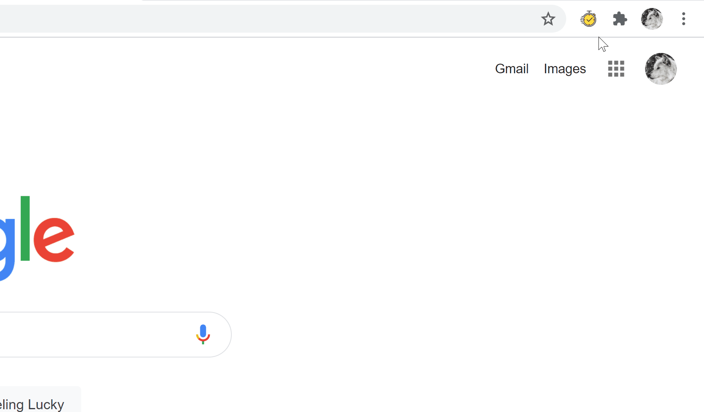

**Traceback** is a Google Chrome extension which records the time user spends on different tasks. The aim of Traceback is to improve the time users spent on a task and the effort to do so. It focuses to be an engaging solution, easily accessible to users.

\
It is important for users to track the time and effort spent on certain tasks so that they can analyse where the hours are spent. This allows users to identify which tasks needs to be spent less and allows for improved productivity.

\

## Features
- Task Creation: Fill in a form to create a new task and assigned a label to which category that task belongs.
- Label Creation: Create labels to help organise which tasks belongs to which categories.
- Time Tracking: Track the time (HH:MM:SS) spent on task(s) through an inbuilt timer in the extension. Users can pause and resume each task separately even while the extension popup is minimised.
- Task Info and Timeline: Open a modal to show more detailed information of a task. View the history of tasks listed by day, as well how long they have been using Traceback to track task(s) per day.
- Task Search: Search up tasks based on its name or label. Allows quick access for users to get more detailed information, play, delete and finish that task.

## Tech Stack
- React application mainly using **styled components** and **React Hooks**
- Persistent storage was handled both with the [Chrome Storage API](https://developer.chrome.com/docs/extensions/reference/storage/) for local storage and [Amazon Web Services](https://aws.amazon.com/) (specifically [AWS Lambda](https://aws.amazon.com/lambda/), [Amazon API Gateway](https://aws.amazon.com/api-gateway/) and [Amazon DynamoDB](https://aws.amazon.com/dynamodb/)) for a serverless backend

## Inspiration for the Project
### Background
This project was started during my involvement with Real Skills Education: Winter 2020 STEM Leaders Program. At the time, I had very limited exposure towards developing React applications and there was so much I can accomplish with my limited web development skills.

However, from that point on, after learning more about developing React applications, this project now serves as a reinvention of that concept. Now that I am more confident with my web development skills, this project idea was rebuilt from scratch with some new and improved features. Original project repo can be found [here](https://github.com/noah-lackey/time-tracer).

### Motivation
The initial concept of this project was to assist Accenture's employees to reduce the time and effort to record their time it takes on certain tasks and projects, able to analyse where the hours are spent by each individual in the team. 

Previous solutions for this problem includes using a Splunk time tracker  however it is very easy to forget for employees to fill in the timesheets at the end of the day. Thus, the approach of developing a chrome extension was taken as employees spend most of their time with their browsers open.

The original project focuses on Accenture's specific needs. However, this current iteration of the project has been made so that features are more widely accessible to all users.

## Future Developments
Traceback could be further developed in the future with some ideas such as:
- Exporting data to an Excel document
- Data visualisation within the application which shows which times the user has spent recording which tasks (similar to Apple's iPhone Screen Time functionality)
- Data can be sent to a centralised data visualisation platform such as Splunk
- Gamification elements
