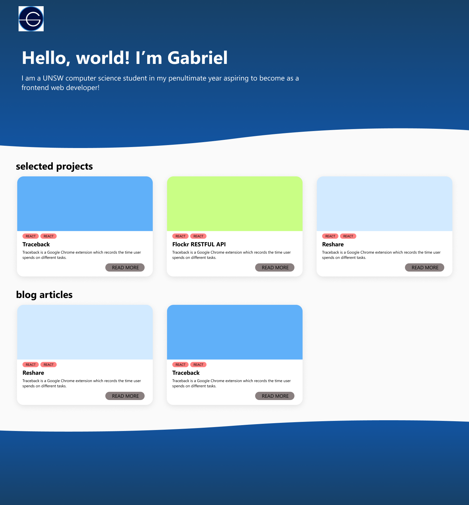

# Overview
Created my portfolio website as a means to showcase my personal projects and achievements. I used Gatsby to render markdown documents to html. This allows me to easily write down my thoughts in a markdown document which made it much more easier to edit my writing in markdown rather than through html. Gatsby then is able to generate separate pages for each markdown document.

# Design
I tried to go for a simplistic design that aims to convey information effectively. I used Figma to sketch up some design prototypes on how I want my portfolio website to look like as shown below.

# Tech Stack
- React application with Gatsby
- Github Pages for deployment